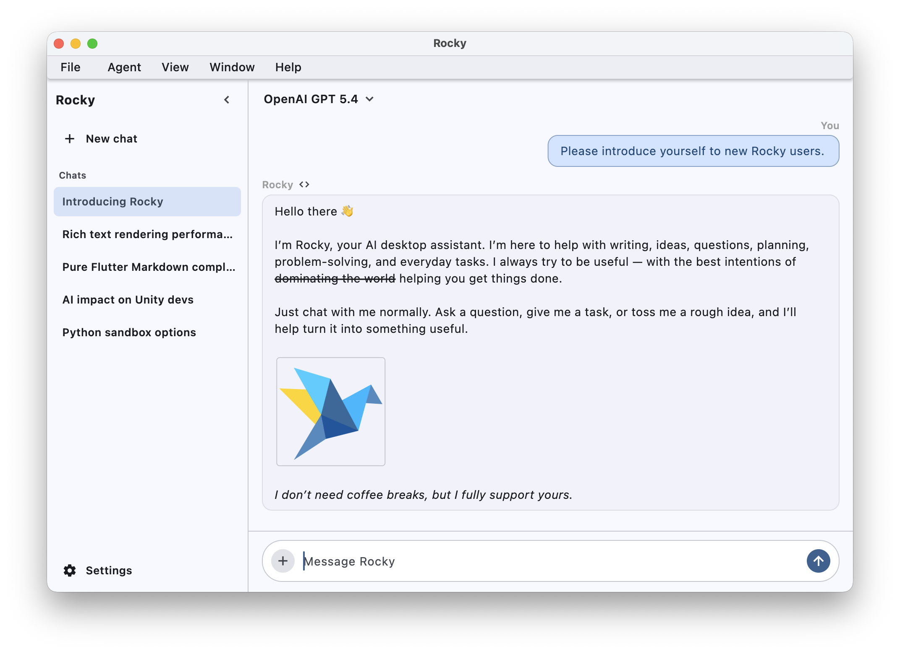

# Rocky

Rocky is an open source desktop agent, built with pure Python on top of [Flut](https://github.com/yangyuan/flut) and the OpenAI Agents SDK.

Rocky has no intention of competing with business-oriented products. Instead, it aims to provide a clean, easy-to-follow base for everyone, whether you want to learn how to build an agent or fork it as a starting point for your own project. Rocky believes anyone can build an agent, and the agent community deserves more choices, rather than being locked into any platform.



## Project Highlights

- **Pure Python**: the entire app, UI included, is a plain Python process. No complex dependencies or installation steps.
- **Polished Cross-Platform Desktop**: powered by Flut, Rocky delivers a Flutter-backed desktop experience on Windows, macOS, and Linux.
- **Reusable Design and Code**: clean separation between Flutter widgets, agentic logic, and tools. Each can be reused independently.

## Agent Features

- Multiple shell environments: Connect to various shell environments to complete user tasks or control them on behalf of the user.
- More are coming soon.

## Usage

Rocky requires **Python 3.10+**.

**1. Install Python**

- **Windows**: install from [python.org](https://www.python.org/downloads/), or simply type `python` in a command prompt and follow the prompts.
- **macOS / Linux**: Python 3 is usually preinstalled. Verify with `python3 --version`, or install via Homebrew or your package manager if missing. You may need to use `python3`/`pip3` instead of `python`/`pip`.

**2. Install dependencies**

```
pip install -r ./requirements.txt
```

**3. Run the app**

```
python app.py
```

On first launch, open the in-app settings to configure a model provider, then start your agentic journey.

## Model Providers and Local Models

Rocky is built on the OpenAI Agents SDK, which is largely provider-agnostic. In principle, Rocky can work with any model provider the SDK supports, directly or indirectly.

Rocky also integrates [LiteRT-LM](https://github.com/google-ai-edge/LiteRT-LM) for **in-process local models**, letting you run models on-device without a separate server.

LiteRT-LM is currently **not bundled** with Rocky and must be installed manually:

```
pip install litert-lm
```

- **macOS** and **Linux**: supported.
- **Windows**: pending, blocked by upstream LiteRT-LM Windows support.

## Shell Environments

Rocky can connect to a Docker container, a WSL distribution, a remote machine and more. Add an environment in Settings, choose it from the chat header, and Rocky can use it when the selected model supports tools.

Supported environment types:

- **Docker**: run commands inside a local Docker container.
- **SSH**: run commands on a remote host over SSH.
- **WSL**: run commands inside a local WSL distribution.
- **Docker in WSL**: run Docker commands through a WSL distribution.
- **Docker over SSH**: run Docker commands on a remote host over SSH.

## License

[MIT License](LICENSE).
